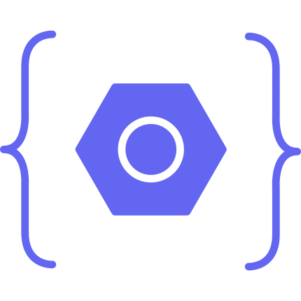

<p align="center">
  
</p>

<h1 align="center">Next.js Rules Builder</h1>

<p align="center">
  A glassmorphism rules generator for clean Next.js agent instructions.
</p>

## Overview

Next.js Rules Builder helps generate export-ready project rules for Claude, Cursor, GitHub Copilot, or a generic coding agent. It includes a visual folder structure editor, package rule builder, live markdown preview, theme controls, smooth scrolling, and a minimal glass UI.

## Features

- `src`-first architecture with App Router pages.
- Glassmorphism interface with multiple themes.
- Animated background and cursor effects.
- Sidebar navigation with tooltips, fullscreen, pin, theme, export, copy, and preview controls.
- Preview modes: both panels, preview only, or hidden preview.
- Visual folder tree editor with drag-and-drop, long-press movement, rename, add, delete, import, and ASCII export.
- Package manager and dependency rule builder.
- Live markdown output for agent rule files.
- Lenis smooth scrolling and custom themed scrollbars.

## Project Structure

```txt
src
├── app
│   ├── main
│   ├── layout.tsx
│   └── page.tsx
├── components
│   ├── common
│   └── ui
├── features
│   └── rules-builder
└── shared
    ├── hooks
    ├── lib
    └── types
```

## Getting Started

Install dependencies:

```bash
npm install
```

Run the development server:

```bash
npm run dev
```

Open [http://localhost:3000](http://localhost:3000) or [http://localhost:3000/main](http://localhost:3000/main).

## Scripts

```bash
npm run dev
npm run build
npm run lint
npm run start
```

## Tech Stack

- Next.js 16 App Router
- React 19
- TypeScript
- Tailwind CSS 4
- dnd-kit
- Lenis
- Lucide React
